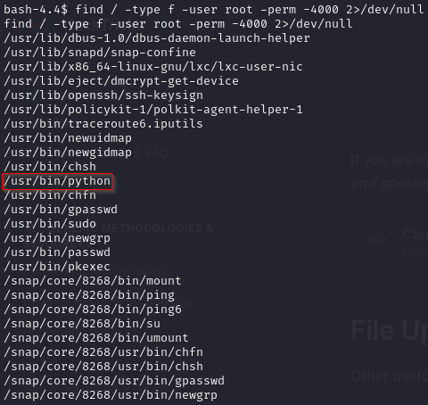

# Máquina: RootMe

**Tryhackme: RootMe**

# NMAP

Lo primero que haremos, será lanzar un NMAP para ver qué puertos tiene abiertos la máquina:

Como se observa en la imagen anterior, existen varios servicios que nos pueden interesar:

- Puerto 22 (SSH)
- Puerto 80 (SSH)

# Enumeración: Puerto 80

Si accedemos a la página expuesta por el sistema objetivo, podremos observar lo siguiente:

Como vemos en la imagen anterior, la versión del servicio Apache es la 2.4.29 y el lenguaje de programación utilizado, es PHP.

A continuación, realizaremos fuzzing con ffuf. Para ello, utilizaremos el siguiente comando:

Observando la salida del comando, hay un par de directorios que nos llaman especialmente la atención:

Como se observa en la imagen anterior, existe un directorio llamado "panel" y un directorio "uploads".

En el directorio "panel" podríamos intentar subir una reverse shell:

Y en el directorio "uploads" podremos comprobar y ejecutar nuestra reverse shell para darnos acceso a la máquina objetivo.

# Explotación: Puerto 80

Antes de subir una reverse shell, primeramente tendremos que crearla. Para ello, nos iremos a Pentestmonkey y nos descargaremos la plantilla que tienen para crear reverse shells en PHP.

Una vez descargada, modificaremos los campos comentados con "CHANGE THIS" y guardaremos los cambios realizados.

Ahora le daremos permisos de ejecución al fichero con "chmod" y lo subiremos desde el directorio "/panel/".

Como se observa en la imagen anterior, la página no permite subir ficheros ".php". Por lo tanto, vamos a tener que buscarnos la manera de subir dicho fichero.

Algo que podríamos hacer, por ejemplo, sería modificarle la extensión al archivo. Por ejemplo, en vez de ".php", que sea ".php.jpg", así el sistema no lo detectaría como fichero ".php", sino como una imagen.

Como se observa en la imagen anterior, el fichero se ha subido con éxito. A continuación, revisaremos el directorio "/uploads" para ver que el fichero está en dicho directorio.

Ahora si lo ejecutamos, veremos que nuestra máquina Kali no recibirá shell a través del "nc" por el que está escuchando.

Por lo tanto, vamos a tener que buscarnos una extensión de archivo que la página si sea capaz de interpretar.

Si nos vamos a la página de Hacktricks, podremos observar las distintas extensiones que se pueden utilizar para poder realizar un "File Upload" en caso de que no podamos subir directamente un fichero ".php" a la máquina objetivo.

Nosotros en este caso, vamos a utilizar por ejemplo la extensión ".phtml". Así que, volveremos a cambiarle la extensión al archivo y lo volvemos a subir. Si todo ha ido bien, al ejecutarlo desde la carpeta "/uploads/", recibiremos una reverse shell en nuestra máquina Kali.

Ya estaríamos dentro del sistema objetivo.

# Flag: user.txt

Para dar con la flag del usuario, nos tendremos que dirigir al directorio "/var/www/" de la máquina objetivo. Una vez allí, si listamos el contenido del directorio, nos encontraremos con el fichero "user.txt".

# Upgrade shell

A continuación, vamos a upgradear la shell para hacerla algo más estable.

# Flag: root.txt

Para la escalada de privilegios, nos aprovecharemos de los permisos SUID de los binarios que tengan el bit SUID configurado. Para ello, ejecutaremos el siguiente comando para buscar dichos binarios:

Como se observa en la imagen anterior, el comando "python" tiene el bit SUID configurado, cosa que es bastante peligrosa, ya que podría operar con los permisos del usuario propietario de un archivo, en lugar de los permisos del usuario que ejecutó el comando.

Entonces, lo que vamos a hacer a continuación, es ir a GTFObins y vamos a buscar un comando que nos permita elevar privilegios utilizando el comando "python".

A continuación, nos iremos a la shell y escribiremos el comando señalado anteriormente.

Como se observa en la imagen anterior, ya somos "root".

Para encontrar la flag, nos iremos al directorio "/root" y listaremos su contenido. Una vez listado, veremos que la flag se encuentra dentro de dicho directorio.

